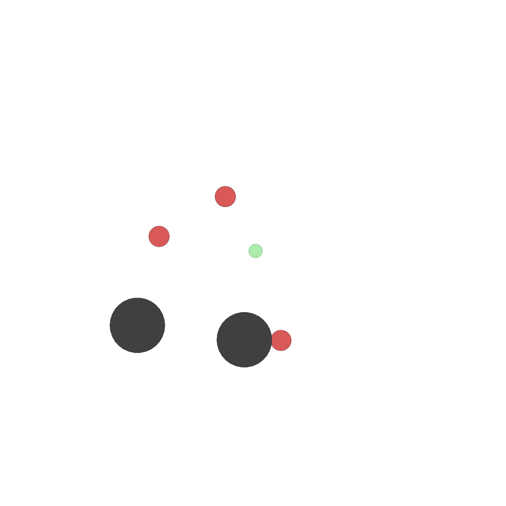
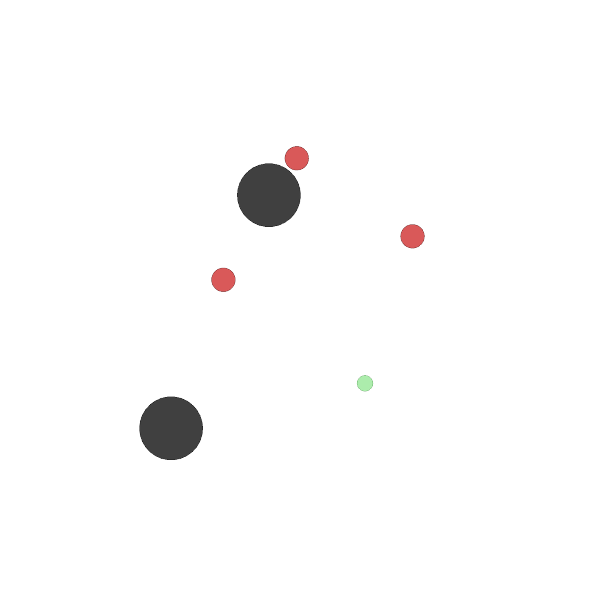

# CMU 18662 Course Project - Multi-Agent Reinforcement Learning with Continuous Actions

# TODO

1. Update on results sections in README
2. Final paper and presentation

# Usage

Training and evaluation is simple and straightforward, please use the following commands:

```shell
python main.py simple_tag_v2  # training
python evaluate.py simple_tag_v2 1  # evaluate result saved in folder 1
```

more details about arguments can be found in `main.py`, `evaluate.py`
or simply run `python main.py --help`, `python evaluate.py --help`

# Result

|  environment name   | training result                                      | evaluation result                                    |
|  ----  |------------------------------------------------------|------------------------------------------------------|
| simple_tag (maddpg vs. maddpg) |              |              | 
| simple_tag (qmix vs. maddpg) |              |              | 

# Reference

- Implementation of [openai](https://github.com/openai/maddpg)
- Implementation of [shariqiqbal2810](https://github.com/openai/maddpg)
- Implementation of [maddpg-mpe-pytorch](https://github.com/Git-123-Hub/maddpg-mpe-pytorch)
- Implementation of [PettingZoo](https://github.com/Farama-Foundation/PettingZoo)
- Implementation of [maddpg-mpe-pytorch](https://github.com/Git-123-Hub/maddpg-pettingzoo-pytorch) with Pettingzoo
